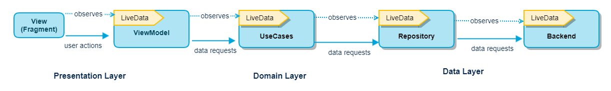

# CoroutinesTesting
A sample app to showcase the basics of using **MVVM architecture** in an Android Project. Uses **Coroutines**. Written in **Kotlin**

**Presentation layer** that contains a fragment (View) and a ViewModel per feature

**Domain layer** that uses Use-Cases for business logic

**Data layer** with a repository and a data source (Server) that are queried with one-shot operations (no listeners)
